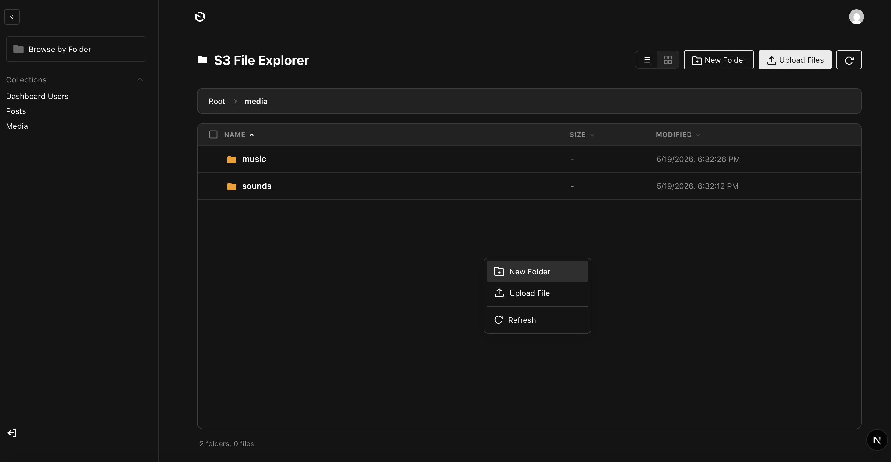

# Payload Storage File Explorer

A Payload CMS plugin that adds an S3-compatible file explorer to the Payload admin. It mounts an admin view and registers small Payload endpoints to list, preview, download, upload (presigned POST), create folders, and delete objects or prefixes.


## Overview

- **Admin UI**: Adds a configurable admin route (default `/explorer`) with list/grid views, previews, drag & drop uploads, bulk actions and folder navigation.
- **Server endpoints**: Registers Payload endpoints under `/api/s3-explorer` for listing, presigned uploads, presigned downloads, folder creation and deletion.
- **S3-compatible**: Uses AWS SDK for S3 but supports custom endpoints (MinIO, LocalStack) and path-style URLs.

## Features

- **Browse buckets**: paginate and show folders/files with sizes and last-modified.
- **Preview & download**: presigned GET URLs for preview/download of objects.
- **Direct uploads**: presigned POST (browser → S3) with size and MIME constraints.
- **Folder create**: creates zero-byte "folder" placeholder objects (key ends with `/`).
- **Delete**: delete single objects or recursively delete a prefix (folder).
- **Bulk actions**: select multiple files to download or delete.
- **Configurable**: enable/disable uploads, deletes, downloads; set root prefix, max upload size, presigned expiry, navigation label and admin route and access-level per actions.

## Quick Install

1. Install the package in your project (example using pnpm):

```bash
pnpm add payload-storage-file-explorer
```

2. Add the plugin to your Payload config (`payload.config.ts`):

```ts
import { payloadStorageFileExplorer, s3ExplorerPluginOptions } from 'payload-storage-file-explorer'

export default buildConfig({
  plugins: [
    payloadStorageFileExplorer({
      adapterOptions: s3ExplorerPluginOptions({
        bucket: process.env.S3_BUCKET!,
        credentials: {
          accessKeyId: process.env.S3_ACCESS_KEY!,
          secretAccessKey: process.env.S3_SECRET_KEY!,
        },
        endpoint: process.env.S3_ENDPOINT!,
        region: 'eu-west-3',
        // Optional: limits
        allowedMimeTypes: ['image/*', 'application/pdf', 'video/*'],
        forcePathStyle: true,
        storageType: 's3',
      }),

      // Optional: custom route & label
      adminRoute: '/explorer',
      navigationLabel: 'File Explorer',

      // Optional overrides
      maxUploadSize: 50 * 1024 * 1024, // 50 MB

      // Optional: disable features
      enableDelete: true,
      enableDownload: true,
      enableFolderCreate: true,
      enableUpload: true,

      // Optional: presigned URL expiry (seconds)
      presignedUrlExpiry: 3600,

      // Optional: scope to a subfolder
      // rootPrefix: 'uploads/',

      // Optional: scope operation per users
      access: {
        canUpload: async ({ req }) => {
          'use server'
          return Boolean(req.user) && req?.user?.role === 'admin';
        },
        canDelete: async ({ req }) => {
          'use server'
          return Boolean(req.user) && req?.user?.email === 'super-admin';
        }
      },
    }),
  ],
})
```

- **Configuration options**

| Option | Description | Default |
| --- | --- | --- |
| **`adapterOptions`** | Required adapter configuration. Currently the plugin supports an S3-compatible adapter; see `S3ExplorerPluginOptions`. | *Required* |
| **`adminRoute`** | Admin path where the view is mounted. | `/explorer` |
| **`enableDelete`** | Allow deleting objects/prefixes. | `true` |
| **`enableDownload`** | Enable presigned downloads. | `true` |
| **`enableFolderCreate`** | Allow creating folders. | `true` |
| **`enableUpload`** | Allow uploads. | `true` |
| **`maxUploadSize`** | Max upload size in bytes. | `100 * 1024 * 1024` (100 MB) |
| **`navigationLabel`** | Label for admin sidebar. | `File Explorer` |
| **`presignedUrlExpiry`** | Presigned GET expiry in seconds. | `3600` |
| **`rootPrefix`** | Optional root prefix to scope explorer to a subfolder. | `''` |
| **`access`** | Optional access callbacks to control per-operation permissions. Supported callbacks: <br>`canList`, <br>`canDownload`, <br>`canUpload`, <br>`canDelete`, <br>`canCreateFolder`.<br><br> Each callback receives an object with `{ req, key?, prefix?, item? }` and may be async; return `true` to allow the operation for the current user/item.<br> If omitted, global `enable_X` booleans control behavior. | `-`


### API Endpoints

All endpoints are registered on the plugin and available under `/api/s3-explorer`.

- GET `/api/s3-explorer/list?prefix=<prefix>&token=<continuationToken>`
  - Response: `{ success: true, data: S3ListResult }`
- GET `/api/s3-explorer/download?key=<objectKey>`
  - Returns a presigned GET URL: `{ success: true, data: { key, url } }`
- POST `/api/s3-explorer/upload`
  - Body: `{ prefix, filename, contentType }`
  - Returns presigned POST details: `{ success: true, data: { url, fields, key } }`
- POST `/api/s3-explorer/folder`  — create new folder placeholder
  - Body: `{ prefix, name }` → `{ success: true, data: { folderKey } }`
- DELETE `/api/s3-explorer/delete`
  - Body: `{ key }` deletes a single object OR `{ prefix }` deletes all objects under that prefix (recursive)

Examples (list & download):

```bash
curl 'http://localhost:3000/api/s3-explorer/list?prefix=media/'

curl 'http://localhost:3000/api/s3-explorer/download?key=media/example.jpg'
```

## Adapters

This plugin is built to support interchangeable storage adapters. At present it ships with an S3-compatible adapter. Future releases may add additional adapters (e.g., Vercel Blob, Google Cloud Storage, Azure Blob).


**S3 (current)**

Use the `s3ExplorerPluginOptions()` helper to build S3 adapter options. Supported S3 adapter options (see [src/types/index.ts](src/types/index.ts)):

- `bucket` (string) — required S3 bucket name.
- `region` (string) — AWS region.
- `credentials` — optional `{ accessKeyId, secretAccessKey, sessionToken? }`.
- `endpoint` — optional custom endpoint (MinIO, LocalStack).
- `forcePathStyle` — boolean for path-style URLs (MinIO/local testing).
- `allowedMimeTypes` — `'*'` or array of MIME types to restrict uploads.

The plugin will fall back to environment credentials / IAM role if `credentials` are omitted.


**License & support**

This repository is provided as-is. For questions about Payload integration, contact the Payload team or open an issue in this repository.
